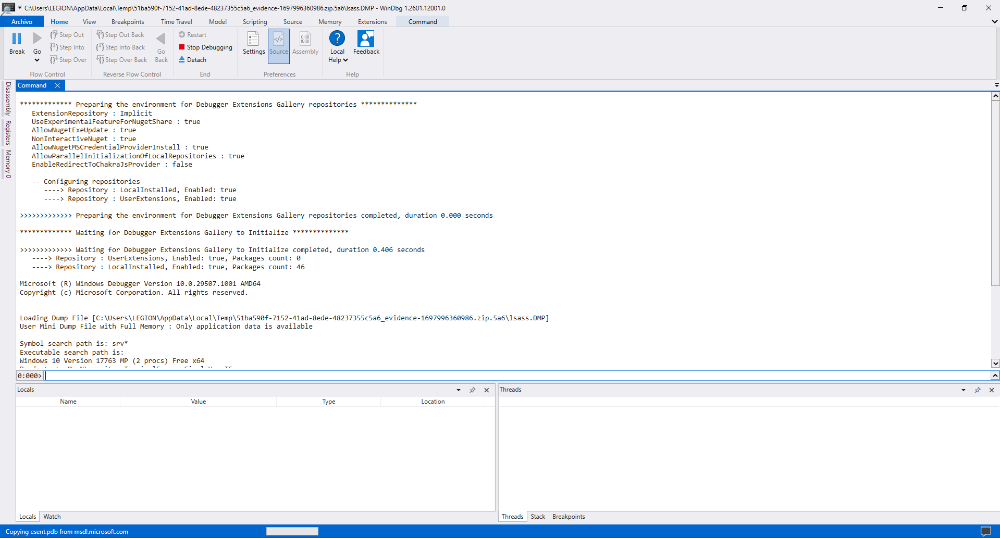
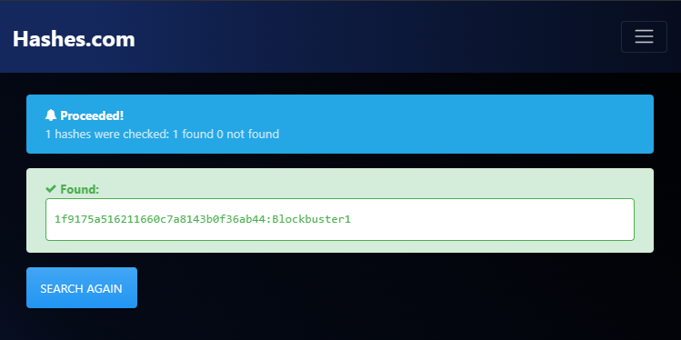
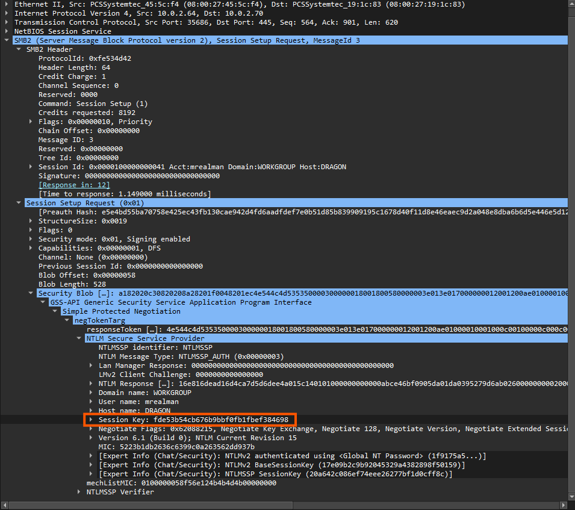
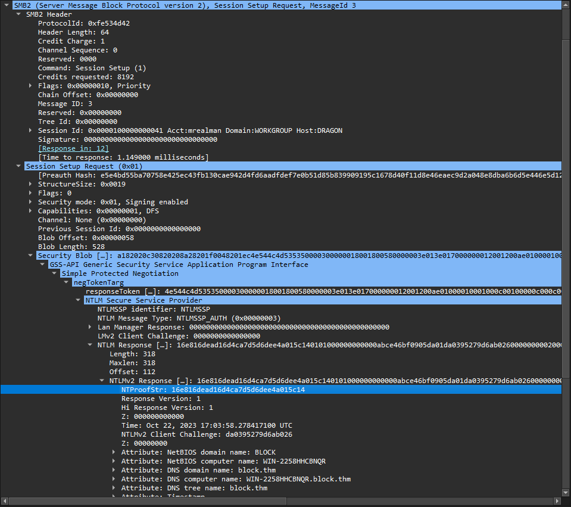
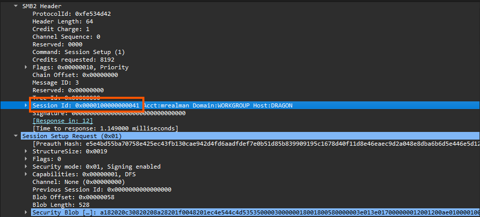
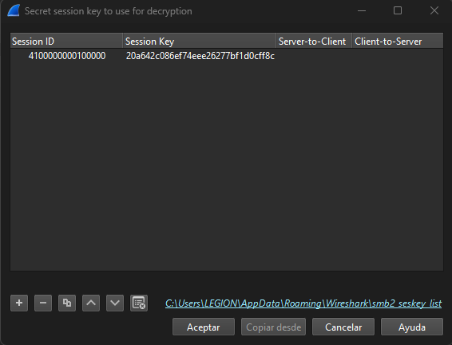
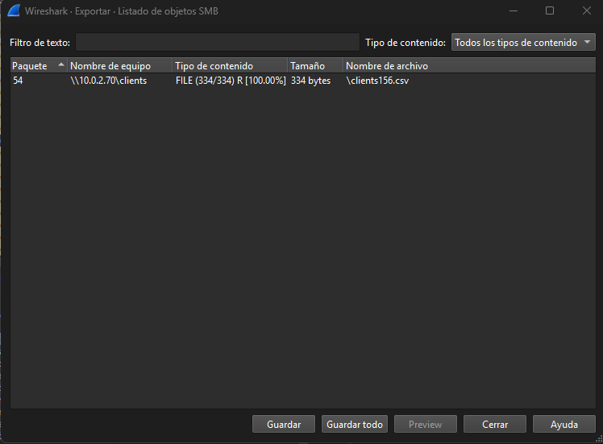
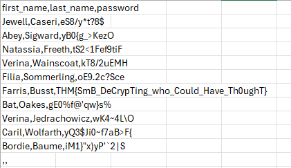

# Crypto Challenge: <Challenge Name>

**Platform:** TryHackMe  
**Category:** Cryptography  
**Difficulty:** Medium  
**Date:** 2026-03-09

---

# Challenge Description

> One of your junior system administrators forgot to deactivate two accounts from a pair of recently fired employees.
We believe these employees used the credentials they were given in order to access some of the many private files from our server, but we need concrete proof.
The junior system administrator only has a small network capture of the incident and a memory dump of the Local Security Authority Subsystem Service process.
Fortunately, for your company, that is all you need.


---

# Initial Analysis

```bash
ls
```

```text
evidence-1697996360986.zip
```

```bash
unzip evidence-1697996360986.zip
```

```text
evidence-1697996360986.zip  lsass.DMP  traffic.pcapng
```
https://learn.microsoft.com/es-es/windows-hardware/drivers/debugger/#install-windbg-directly



```bash
pypykatz lsa minidump lsass.DMP
```

https://hashes.com/en/decrypt/hash


```text
FILE: ======== lsass.DMP =======
== LogonSession ==
authentication_id 1883004 (1cbb7c)
session_id 3
username mrealman
domainname BLOCK
logon_server WIN-2258HHCBNQR
logon_time 2023-10-22T16:53:54.168637+00:00
sid S-1-5-21-3761843758-2185005375-3584081457-1104
luid 1883004
        == MSV ==
                Username: mrealman
                Domain: BLOCK
                LM: NA
                NT: 1f9175a516211660c7a8143b0f36ab44
                SHA1: ccd27b4bf489ffda2251897ef86fdb488f248aef
                DPAPI: 3d618a1fffd6c879cd0b056910ec0c3100000000
        == WDIGEST [1cbb7c]==
                username mrealman
                domainname BLOCK
                password None
                password (hex)
        == Kerberos ==
                Username: mrealman
                Domain: BLOCK.THM
        == WDIGEST [1cbb7c]==
                username mrealman
                domainname BLOCK
                password None
                password (hex)

```
The username is: 
mrealman
The hash is :
1f9175a516211660c7a8143b0f36ab44
https://hashes.com/en/decrypt/hash
The password is :
Blockbuster1




```bash
== LogonSession ==
authentication_id 828825 (ca599)
session_id 2
username eshellstrop
domainname BLOCK
logon_server WIN-2258HHCBNQR
logon_time 2023-10-22T16:46:09.215626+00:00
sid S-1-5-21-3761843758-2185005375-3584081457-1103
luid 828825
        == MSV ==
                Username: eshellstrop
                Domain: BLOCK
                LM: NA
                NT: 3f29138a04aadc19214e9c04028bf381
                SHA1: 91374e6e58d7b523376e3b1eb04ae5440e678717
                DPAPI: 87c8e56bc4714d4c5659f254771559a800000000
        == WDIGEST [ca599]==
                username eshellstrop
                domainname BLOCK
                password None
                password (hex)
        == Kerberos ==
                Username: eshellstrop
                Domain: BLOCK.THM
        == WDIGEST [ca599]==
                username eshellstrop
                domainname BLOCK
                password None
                password (hex)
        == DPAPI [ca599]==
                luid 828825
                key_guid c03cf95e-ff22-4fe9-aac6-93b9586d37c8
                masterkey b0bf26e3ee42acb190007958d5514a966ba87f4425d14688566b9a31e0fd98687bf28c9b5a21bc47f53380967cd871d5b56023b7318cd04d9cf4ba6663cd4d9c
                sha1_masterkey c7bee2cb7cdd6eb62201adda6d034ea41a126c7c
```
The username is: 
eshellstrop
The hash is:
3f29138a04aadc19214e9c04028bf381





Session Key:
fde53b54cb676b9bbf0fb1fbef384698




NTProofStr:
16e816dead16d4ca7d5d6dee4a015c14


```bash
python.exe .\SMBv2\getSMB.py -u mrealman -p Blockbuster1 -d WORKGROUP -n 16e816dead16d4ca7d5d6dee4a015c14 -k fde53b54cb676b9bbf0fb1fbef384698
```
```text
[!] RANDOM SESSION KEY: 20a642c086ef74eee26277bf1d0cff8c
```

Edit>Preference>Protocol>SMB2>Edit
We use this:
Session ID:
4100000000100000
Session Key:
20a642c086ef74eee26277bf1d0cff8c

File>Export as object>SMB

Save 


User 1:  
Username:	mrealman
Password:	Blockbuster1
Session Key:	fde53b54cb676b9bbf0fb1fbef384698
NTProofStr:	16e816dead16d4ca7d5d6dee4a015c14


python.exe .\SMBv2\getSMB.py -u mrealman -p Blockbuster1 -d WORKGROUP -n 16e816dead16d4ca7d5d6dee4a015c14 -k fde53b54cb676b9bbf0fb1fbef384698


[!] RANDOM SESSION KEY: 20a642c086ef74eee26277bf1d0cff8c
Flag: THM{SmB_DeCrypTing_who_Could_Have_Th0ughT}

Repeat the proceess for user 2:
User 2:
Username:	eshellstrop
Hash:		3f29138a04aadc19214e9c04028bf381
NTProofStr: 	0ca6227a4f00b9654a48908c4801a0ac
Session Key: 	c24f5102a22d286336aac2dfa4dc2e04

python.exe .\SMBv2\getSMB.py -u eshellstrop -H 3f29138a04aadc19214e9c04028bf381 -d WORKGROUP -n 0ca6227a4f00b9654a48908c4801a0ac -k c24f5102a22d286336aac2dfa4dc2e04

[!] RANDOM SESSION KEY: facfbdf010d00aa2574c7c41201099e8
Flag:THM{No_PasSw0Rd?_No_Pr0bl3m}

Identify the type of cryptographic technique used.

Possible indicators:

- Base encoding
- Classical cipher
- Hash
- Encryption algorithm
- Public key cryptography

Observations:

- Suspicious string
- Known patterns
- Encoding indicators

Example:

```
U2FsdGVkX1+z7Z8b...
```

---

# Cipher Identification

Possible cipher types considered:

- Base64
- Caesar Cipher
- Vigenère
- XOR
- AES

Reasoning:

Explain why you suspect a particular cipher.

---

# Decoding / Decryption Process

Steps taken to solve the challenge.

### Step 1 – Test Base64

```bash
echo "U2FsdGVkX1+z7Z8b..." | base64 -d
```

Result:

```
Salted__....
```

---

### Step 2 – Further Analysis

Explain the next step.

Example:

- Identify OpenSSL encryption
- Try password attack
- Test XOR key

---

# Script / Tool Used

If a script was used:

```python
import base64

cipher = "U2FsdGVkX1+z7Z8b..."
decoded = base64.b64decode(cipher)

print(decoded)
```

Or tool:

```bash
cyberchef
openssl
hashcat
john
```

---

# Result

Decrypted message:

```
flag{example_flag}
```

---

# Explanation

Explain **why the attack worked**.

Example:

The ciphertext was Base64 encoded. After decoding, the result revealed an OpenSSL encrypted structure that required a password to decrypt.

---

# Lessons Learned

- Recognizing encoding patterns is crucial.
- Base64 is not encryption.
- Layered encoding is common in CTF challenges.

---

# Tools Used

- CyberChef
- Python
- OpenSSL
- hashcat

---

# References

- https://gchq.github.io/CyberChef/
- https://cryptii.com/
- https://ctf101.org/cryptography/